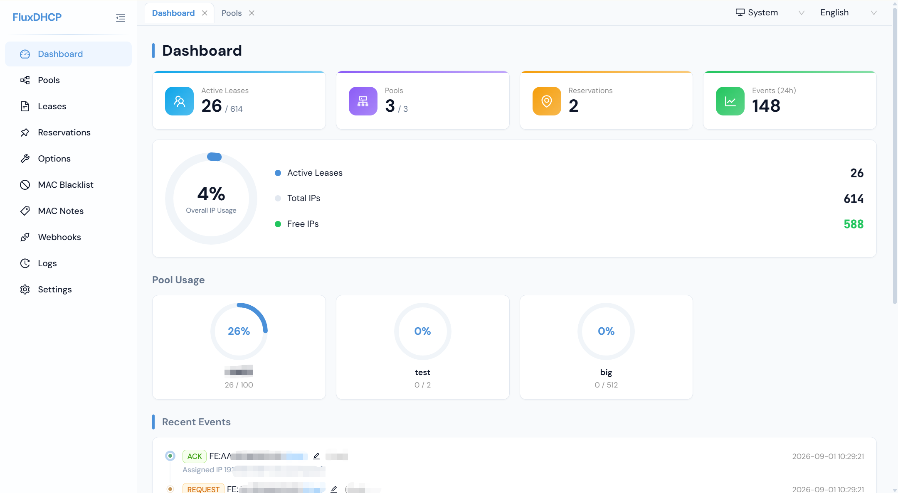

# FluxDHCP

> A lightweight, self-hosted DHCPv4 server with a modern web management UI.

[English](./README.md) | [中文](./README_CN.md)

## Features

- **Full DHCPv4 Protocol** - RFC 2131 compliant: DISCOVER/OFFER/REQUEST/ACK/NAK/RELEASE/DECLINE/INFORM
- **IP Pool Management** - Define subnets with start/end IP ranges, gateway, DNS servers, netmask, and per-pool lease times with overlap detection. Subnet range validation on create/edit (frontend + backend). Atomic IP allocation prevents race conditions. Configurable allocation order (sequential/random) with optional honoring of client-requested IPs. Dual visualization: color-coded IP grid and detailed IP list with hostname/reservation columns.
- **Static Reservations** - Bind MAC addresses to specific IPs with random MAC generation, active lease conflict detection, and IPv4 format validation
- **Per-device DHCP Options** - Assign custom option codes/values per MAC address with 60+ translated option codes
- **Lease Lifecycle Tracking** - Full state machine: OFFERED/BOUND/RELEASED/EXPIRED with automatic expiry cleanup
- **DECLINE IP Blacklist** - Declined IPs are blocked from reassignment for a configurable duration (default 1 hour), scoped per-pool
- **Packet Logger** - Logs all DHCP transactions with millisecond timestamps, direction (received/sent), raw options, yiaddr/siaddr/giaddr, vendor class, client ID, hostname, and fully localized server response messages
- **MAC Notes** - Dedicated management page for adding custom notes/labels to MAC addresses
- **MAC Blacklist** - Block specific MAC addresses from receiving any DHCP response; blacklist entries can be enabled/disabled individually with optional reason
- **Webhook Notifications** - Push DHCP events (ACK/RELEASE/etc.) to external services via HTTP POST/GET with template variables, custom headers, configurable timeout (default 10s), SSRF-protected URLs
- **Web Dashboard** - Icon stat cards, overall IP usage circular gauge (with active/total/free breakdown), mini ring charts for pool usage (hidden for disabled pools), recent event timeline with consistent row heights
- **Config Import/Export** - Export all configuration to JSON with confirmation modal (card-style category selector, select all/none, count labels, exported-at timestamp display), optional lease/log clearing, data structure validation, and hot-reload
- **Log Retention** - Configurable automatic cleanup of old logs (default 90 days)
- **Dark Mode** - Follow System / Light / Dark theme with CSS variables, Ant Design dark algorithm, and persisted preference
- **Responsive UI** - Mobile-friendly layout with drawer sidebar, responsive cards, compact tables with horizontal scroll, and page size selectors
- **Multi-tab Navigation** - Grounded tab bar with right-click context menu (refresh, close, close others, close right, close all)
- **Loading Splash Screen** - Dark-mode-aware CSS splash screen eliminates flash of unstyled content during initial load
- **i18n Support** - Full English and Chinese localization including DHCP option codes, server response messages, NAK reason codes, and browser locale detection
- **Security** - Origin header validation on API mutations (CSRF protection), SSRF-protected webhook URLs, IP format validation
- **Accessibility** - Focus-visible styles for keyboard navigation, error boundary for crash recovery
- **Docker Ready** - One-command deployment with Docker Compose

## Tech Stack

| Layer | Technology |
|-------|-----------|
| Runtime | Node.js 20+ |
| Frontend | Next.js 15, React 19, Ant Design 5 |
| Backend | Node.js custom server, UDP socket (port 67) |
| Database | SQLite via better-sqlite3 |
| Fonts | Self-hosted via next/font/google (DM Sans, JetBrains Mono) |
| i18n | next-intl |

## Quick Start

### Docker Compose (Recommended)

```bash
git clone https://github.com/dreamage/FluxDHCP.git
cd FluxDHCP
docker-compose up -d
```

Open `http://localhost:3000` in your browser.

### Manual Installation

```bash
git clone https://github.com/dreamage/FluxDHCP.git
cd FluxDHCP
npm install
npm run build
npm start
```

> **Note:** Binding UDP port 67 requires root/admin privileges.

### Development

```bash
npm install
npm run dev
```

## Environment Variables

| Variable | Default | Description |
|----------|---------|-------------|
| `DB_PATH` | `./data/fluxdhcp.db` | SQLite database file path |
| `WEB_PORT` | `3000` | Web UI port |

## Pages

| Page | Description |
|------|-------------|
| **Dashboard** | Stat cards with icons, overall IP usage circular gauge (with active/total/free breakdown), mini ring charts for pool usage (hidden for disabled pools), recent event timeline |
| **Pools** | Address pool CRUD, dual view toggle (IP grid / IP list, default grid), color-coded grid with reserved-online visual distinction (orange bottom strip) and hostname in hover tooltips, list view with show/hide-free toggle plus hostname/MAC/reservation-note columns, expand/collapse all, IPv4 validation, subnet range validation on create/edit (frontend + backend) |
| **Leases** | Lease list with state filtering (ALL/BOUND/OFFERED/EXPIRED/RELEASED), server-side sorting, page size selector, distinct release/delete icons |
| **Reservations** | Static MAC-IP bindings, MAC autocomplete with auto-uppercase, random MAC, auto-fill from notes, active lease conflict detection, IPv4 validation |
| **Options** | Per-device DHCP option overrides, common option code dropdown, page size selector |
| **MAC Blacklist** | Block MAC addresses from DHCP, enable/disable toggle, optional reason, page size selector |
| **MAC Notes** | MAC address labels and notes, sortable columns, page size selector |
| **Webhooks** | Webhook CRUD, event subscription, template variables, custom headers, SSRF-protected URLs, test button |
| **DHCP Logs** | Millisecond timestamps, direction indicator, 60+ option code translations, column visibility selector, auto-refresh (3/5/10/30/60s, default 10s), MAC/IP autocomplete filters, clear-all button with total count, page size selector |
| **Settings** | DHCP service control, server config (IP/listen interface/web port/default lease time), T1/T2 ratios with tooltips, DHCP log retention days, DECLINE blacklist duration, webhook timeout, IP allocation order (sequential/random), honor-client-requested-IP toggle, config import/export (card-style selector, exported-at display, validation) |

## Config Import/Export

Export configuration to a JSON file with selectable categories (leases and logs excluded by default). On import, a confirmation modal displays each category as a card with item counts, select all/none toggles, and the file's exported-at timestamp (converted to local timezone), with optional checkboxes to also clear leases and/or logs. The JSON includes:

- `version` - Config file format version
- `exported_at` - Export timestamp (ISO 8601)
- `config` - Server settings
- `pools` - Address pool definitions
- `reservations` - Static MAC-IP bindings
- `device_options` - Per-device DHCP options
- `mac_blacklist` - MAC blacklist entries
- `mac_notes` - MAC address labels
- `webhooks` - Webhook configurations
- `leases` - Lease records (optional export)
- `dhcp_logs` - DHCP packet logs (optional export)

DHCP config is automatically hot-reloaded after import (no service restart needed).

## Webhook Template Variables

| Variable | Description |
|----------|-------------|
| `{{mac_address}}` | Client MAC address |
| `{{ip_address}}` | Assigned IP address |
| `{{hostname}}` | Client hostname |
| `{{message_type}}` | DHCP message type (e.g. `dhcp_ack`) |
| `{{pool_name}}` | IP pool name |
| `{{mac_note}}` | Custom note for the MAC address |
| `{{timestamp}}` | ISO 8601 timestamp |
| `{{datetime}}` | Local date-time (e.g. `2026-07-23 12:34:56`) |

## Screenshots



## License

This project is licensed under the [GNU Affero General Public License v3.0](./LICENSE).

You are free to use, modify, and distribute this software, but any modifications or derivative works **must also be open-sourced** under the AGPL-3.0 license.
