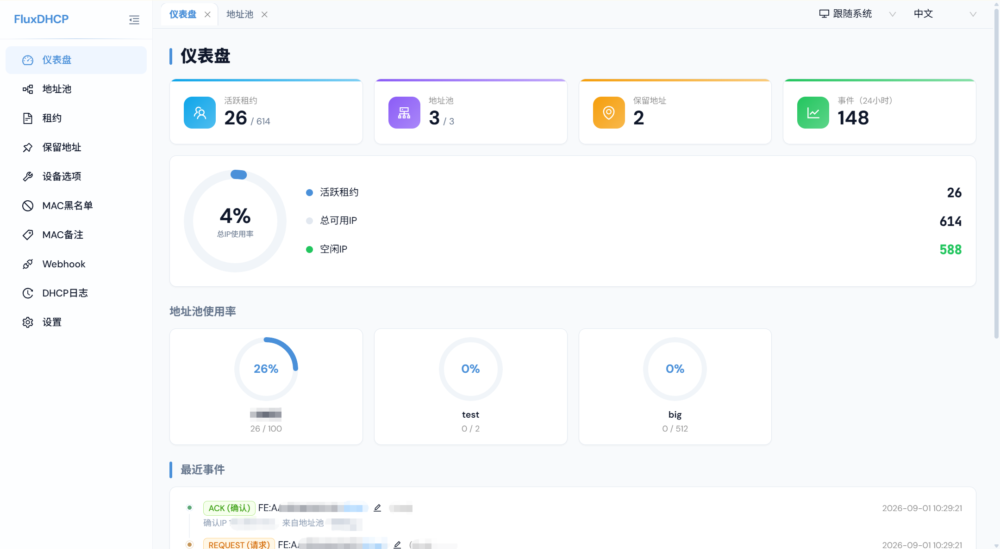

# FluxDHCP

> 一个轻量级、可自托管的 DHCPv4 服务器，配备现代化的 Web 管理界面。

[English](./README.md) | [中文](./README_CN.md)

## 功能特性

- **完整的 DHCPv4 协议** - 符合 RFC 2131 标准：支持 DISCOVER/OFFER/REQUEST/ACK/NAK/RELEASE/DECLINE/INFORM 全部消息类型
- **IP 地址池管理** - 定义子网的起止 IP 范围、网关、DNS 服务器、子网掩码，支持按地址池设置租约时间，自动检测地址池重叠，新建/编辑时校验 IP 是否在子网范围内（前后端双重校验），原子化 IP 分配防止竞态条件，可配置 IP 分配顺序（顺序/随机），支持优先分配客户端请求的 IP。双视图可视化：颜色区分的 IP 地址块和含主机名/保留描述列的 IP 列表。
- **静态地址绑定** - 将 MAC 地址绑定到指定 IP，支持随机 MAC 生成，自动检测活跃租约冲突，IPv4 格式校验
- **设备级 DHCP 选项** - 按 MAC 地址分配自定义 DHCP 选项代码和值，60+ 选项码翻译
- **租约生命周期追踪** - 完整状态机：OFFERED/BOUND/RELEASED/EXPIRED，自动清理过期租约
- **DECLINE IP 黑名单** - 客户端 DECLINE 的 IP 在可配置时长内不会被重新分配（默认 1 小时），按地址池隔离
- **数据包日志** - 毫秒级时间戳，记录所有 DHCP 事务的方向（接收/发送）、原始选项、yiaddr/siaddr/giaddr、厂商类别、客户端 ID、主机名，服务器响应消息完整国际化
- **MAC 备注管理** - 独立页面管理 MAC 地址的备注和标签
- **MAC 黑名单** - 将指定 MAC 地址加入黑名单，DHCP 服务器对其完全静默不响应；支持逐条启用/禁用，可填写封禁原因
- **Webhook 通知** - 将 DHCP 事件通过 HTTP POST/GET 推送到外部服务，支持模板变量、自定义请求头、可配置超时（默认 10 秒），URL 经 SSRF 防护校验
- **Web 仪表盘** - 图标统计卡片、总 IP 使用率圆盘仪表盘（含活跃/总数/空闲统计）、地址池迷你环形仪表盘（隐藏已禁用池）、最近事件时间线（统一行高）
- **配置导入导出** - 导出全部配置为 JSON，导入时显示确认弹窗（卡片式类别选择器、全选/清空、计数标签、显示导出时间），可选清空租约和日志，数据结构校验，配置热加载
- **日志自动清理** - 可配置的日志保留天数（默认 90 天），自动清理过期日志
- **深色模式** - 跟随系统 / 浅色 / 深色三种主题，CSS 变量驱动全部颜色，Ant Design 深色算法，偏好持久化
- **响应式 UI** - 移动端友好：抽屉式侧边栏、响应式卡片、紧凑表格、横向滚动、每页条数选择器
- **多标签页导航** - 底部对齐 Tab 栏，右键菜单支持刷新、关闭、关闭其它、关闭右侧、关闭所有
- **加载动画** - 感知深色模式的纯 CSS 启动屏幕，消除页面加载时的无样式闪烁
- **国际化** - 完整的中英文支持，包括 DHCP 选项码、服务器响应消息、NAK 原因码，浏览器语言自动检测
- **安全** - API 请求 Origin 校验（CSRF 防护）、Webhook URL SSRF 防护、IPv4 格式校验
- **无障碍** - focus-visible 键盘导航样式，React Error Boundary 崩溃恢复
- **Docker 一键部署** - 使用 Docker Compose 快速启动

## 技术栈

| 层级 | 技术 |
|------|------|
| 运行环境 | Node.js 20+ |
| 前端 | Next.js 15、React 19、Ant Design 5 |
| 后端 | Node.js 自定义服务器、UDP Socket（端口 67）|
| 数据库 | SQLite（better-sqlite3）|
| 字体 | next/font/google 自托管（DM Sans、JetBrains Mono）|
| 国际化 | next-intl |

## 快速开始

### Docker Compose（推荐）

```bash
git clone https://github.com/dreamage/FluxDHCP.git
cd FluxDHCP
docker-compose up -d
```

在浏览器中打开 `http://localhost:3000`。

### 手动安装

```bash
git clone https://github.com/dreamage/FluxDHCP.git
cd FluxDHCP
npm install
npm run build
npm start
```

> **注意：** 绑定 UDP 67 端口需要 root/管理员权限。

### 开发模式

```bash
npm install
npm run dev
```

## 环境变量

| 变量 | 默认值 | 说明 |
|------|--------|------|
| `DB_PATH` | `./data/fluxdhcp.db` | SQLite 数据库文件路径 |
| `WEB_PORT` | `3000` | Web 管理界面端口 |

## 页面说明

| 页面 | 说明 |
|------|------|
| **仪表盘** | 图标统计卡片、总 IP 使用率圆盘仪表盘（含活跃/总数/空闲统计）、地址池迷你环形仪表盘（隐藏已禁用池）、最近事件时间线（统一行高） |
| **地址池** | 地址池增删改查，IP 地址块 / IP 列表双视图切换（默认地址块），地址块颜色区分状态（保留且在线的 IP 底部带橙色条纹、悬停显示主机名），列表视图支持显示/隐藏空闲开关及主机名/MAC/保留描述等列，全部展开/收起按钮，IPv4 格式校验，新建/编辑时校验 IP 在子网范围内（前后端双重校验） |
| **租约** | 租约列表，支持状态筛选（全部/已绑定/已提供/已过期/已释放），服务端排序，每页条数选择器，释放和删除操作区分明显 |
| **保留地址** | 静态 MAC-IP 绑定，MAC 地址自动补全（自动大写），随机 MAC 生成，从 MAC 备注自动填充描述，活跃租约冲突检测，IPv4 格式校验 |
| **设备选项** | 按设备的 DHCP 选项覆盖，常用选项码下拉选择，每页条数选择器 |
| **MAC 黑名单** | 屏蔽指定 MAC 地址的 DHCP 响应，支持启用/禁用开关、封禁原因，每页条数选择器 |
| **MAC 备注** | 独立页面管理 MAC 地址的备注标签，支持增删改查和排序，每页条数选择器 |
| **Webhook** | Webhook 增删改查，支持事件订阅、模板变量、自定义请求头、SSRF 防护、测试按钮 |
| **DHCP日志** | 毫秒级时间戳，方向标识，60+ DHCP 选项码翻译，列显示选择器，自动刷新（3/5/10/30/60 秒，默认 10 秒），MAC/IP 自动补全搜索，IP 筛选支持所有 IP 列，清空全部按钮（带总数显示），每页条数选择器 |
| **设置** | DHCP 服务控制、服务器配置（服务器 IP/监听网卡/Web 端口/默认租约时间）、T1/T2 参数（带说明）、DHCP 日志保留天数、DECLINE 黑名单时长、Webhook 超时、IP 分配顺序（顺序/随机）、优先分配客户端请求 IP 开关、配置导入导出（卡片式选择器、显示导出时间、含校验） |

## 配置导入导出

导出全部配置为 JSON 文件，可选择导出类别（默认不含租约和日志）。导入时弹出确认窗口，以卡片式列表显示各类别及数据条目数，支持全选/清空，并显示配置文件的导出时间（自动转换为本地时区），可选择是否同时清空所有租约和/或日志。JSON 文件包含：

- `version` - 配置文件格式版本
- `exported_at` - 导出时间（ISO 8601）
- `config` - 服务器设置（IP、端口、租约时间、T1/T2 比例等）
- `pools` - 地址池定义
- `reservations` - 静态 MAC-IP 绑定
- `device_options` - 设备级 DHCP 选项覆盖
- `mac_blacklist` - MAC 黑名单
- `mac_notes` - MAC 地址备注
- `webhooks` - Webhook 配置
- `leases` - 租约记录（可选导出）
- `dhcp_logs` - DHCP 数据包日志（可选导出）

导入后 DHCP 配置自动热加载，无需重启服务。

## Webhook 模板变量

| 变量 | 说明 |
|------|------|
| `{{mac_address}}` | 客户端 MAC 地址 |
| `{{ip_address}}` | 分配的 IP 地址 |
| `{{hostname}}` | 客户端主机名 |
| `{{message_type}}` | DHCP 消息类型（如 `dhcp_ack`）|
| `{{pool_name}}` | IP 地址池名称 |
| `{{mac_note}}` | MAC 地址的自定义备注 |
| `{{timestamp}}` | ISO 8601 时间戳 |
| `{{datetime}}` | 本地日期时间（如 `2026-07-23 12:34:56`）|

## 界面截图



## 许可证

本项目基于 [GNU Affero 通用公共许可证 v3.0](./LICENSE) 开源。

你可以自由使用、修改和分发本软件，但任何修改或衍生作品**必须同样以 AGPL-3.0 许可证开源**。
